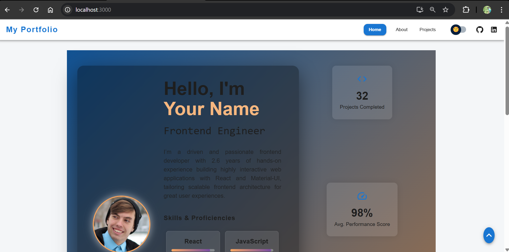
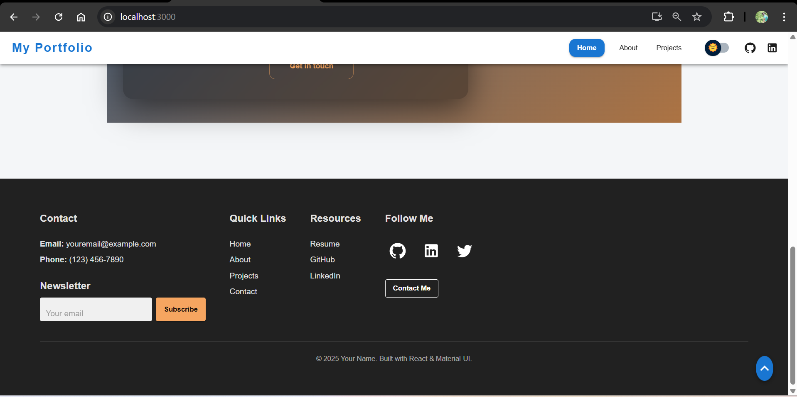
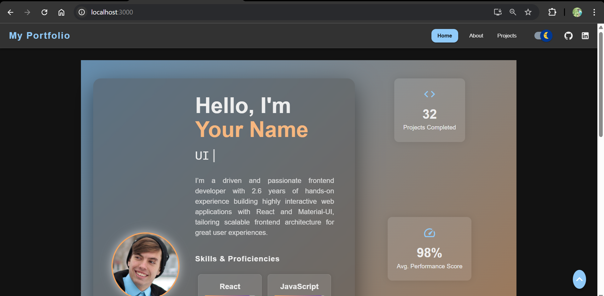
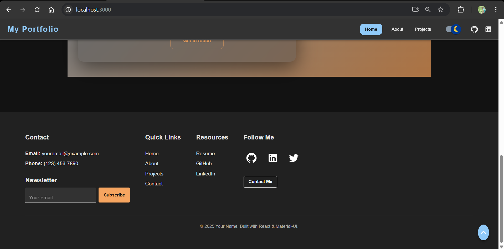
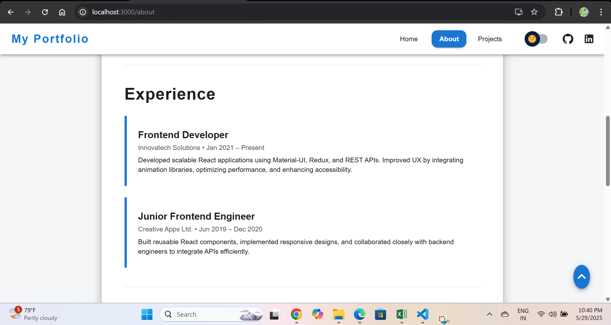
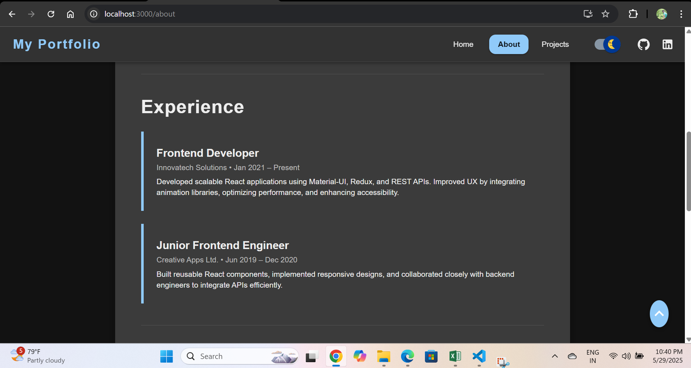
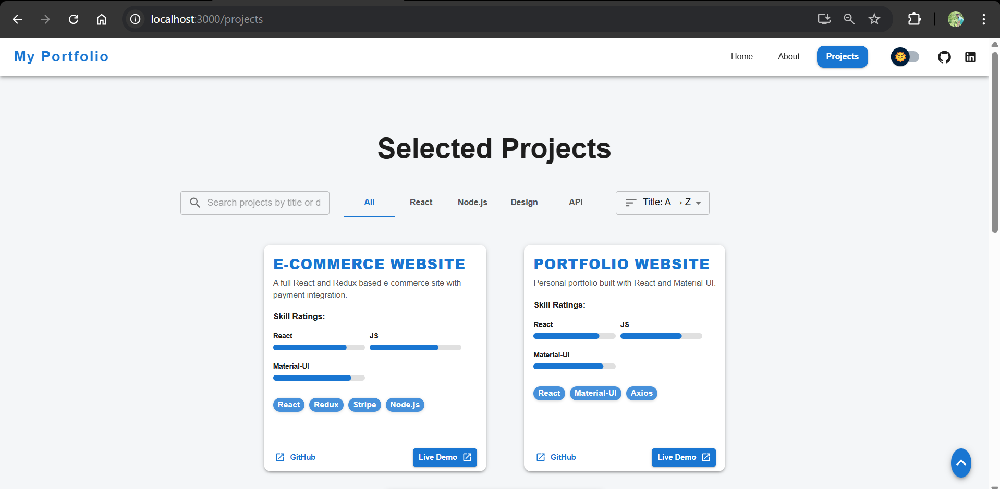
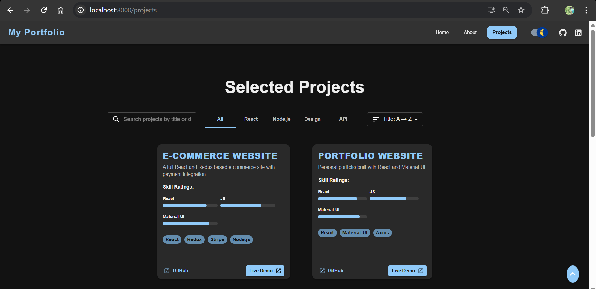

# Abid Dasurkar - React Portfolio

Welcome to my personal portfolio website built with React and Material-UI.  
This project showcases my work, skills, and experience as a Frontend Developer with 2.6 years of professional experience.

---

## 📧 Contact Me

- **Name:** Abid Dasurkar  
- **Email:** [abiddasurkar@gmail.com](mailto:abiddasurkar@gmail.com)

---

## 🖼 UX Screenshots

### 🔆 Light Mode - Home Page


### 🔆 Light Mode - Projects Page


### 🌙 Dark Mode - Home Page


### 🌙 Dark Mode - Projects Page


### 🔆 Light Mode - Home Page (Alt View)


### 🌙 Dark Mode - Home Page (Alt View)


### 🔆 Light Mode - Projects Page (Alt View)


### 🌙 Dark Mode - Projects Page (Alt View)



## 🚀 Features

- Responsive, modern UI built with [Material-UI](https://mui.com/)
- Multi-page site using React Router:
  - Home with dynamic typewriter effect and skills showcase
  - About page detailing my experience and qualifications
  - Projects page listing my portfolio with advanced filtering and sorting
- Dark mode toggle with smooth theme transitions
- Interactive animations implemented using [Framer Motion](https://www.framer.com/motion/)
- API integration simulated with JSON Server and Axios for project data fetching
- Accessible and SEO-friendly semantic markup

---

## 🛠️ Technologies Used

- React (Latest version)  
- Material-UI (MUI)  
- React Router  
- Framer Motion  
- Axios  
- JSON Server (for mock backend)  
- React Simple Typewriter  
- JavaScript (ES6+)  
- HTML5 & CSS3  

---

## ⚙️ Installation & Setup

1. Clone this repository:

    ```bash
    git clone https://github.com/yourusername/react-portfolio.git
    ```

2. Navigate to the project directory:

    ```bash
    cd react-portfolio
    ```

3. Install dependencies:

    ```bash
    npm install
    ```

4. Start JSON Server (mock backend):

    ```bash
    npx json-server --watch src/data/db.json --port 5000
    ```

5. In a separate terminal, start the React development server:

    ```bash
    npm start
    ```

6. Open your browser and visit:

    ```
    http://localhost:3000
    ```

---

## 📦 Folder Structure
react-portfolio/
├── public/
├── src/
│   ├── api/               # API client (Axios config)
│   ├── components/        # React components
│   ├── data/              # Static JSON data for JSON Server
│   ├── styles/            # Custom styles and themes
│   ├── App.jsx            # Main app component with routing
│   ├── index.js           # React entry point
├── package.json
├── README.md

📄 License
This project is open-sourced and free to use.

🤝 Feedback and Contributions
Feel free to open issues or submit PRs for improvements!

Thank you for visiting my portfolio!
— Abid Dasurkar